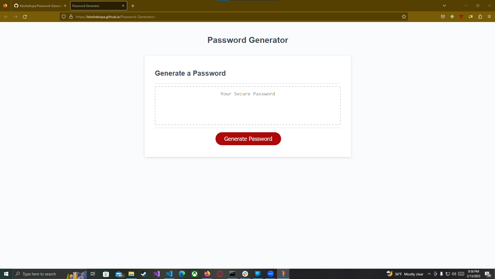
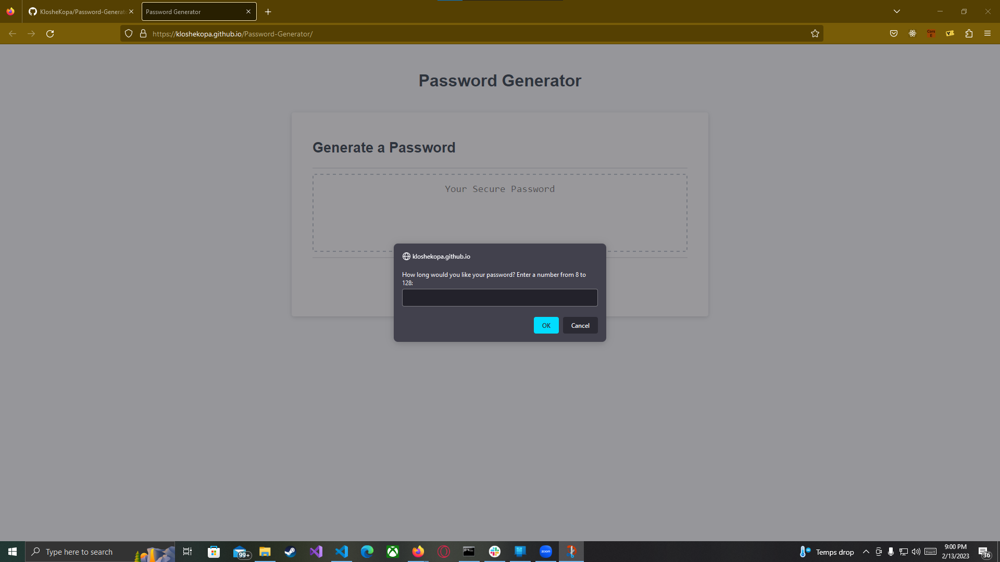
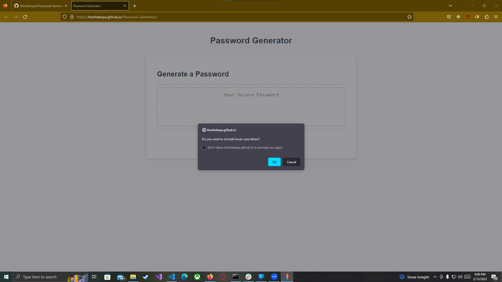
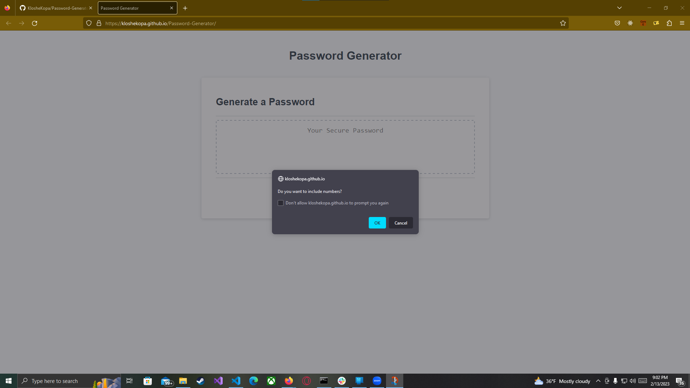

# Password Generator

## Description

This website allows someone to generate a password following a series of prompts.

## Installation

N/A

## Usage

https://kloshekopa.github.io/Password-Generator/

Upon loading in you will hit the landing page. Click the generate password button.

After clicking generate password, a prompt will appear asking for a number between 8 and 128. It will pop up again if the number entered does not fall within those parameters.

Next a series of confirmations will pop up to narrow what options you would want in your password. Ok adds them and cancel removes them.

Finally you will have your generated password filled out inside the text box.

## License

MIT License
